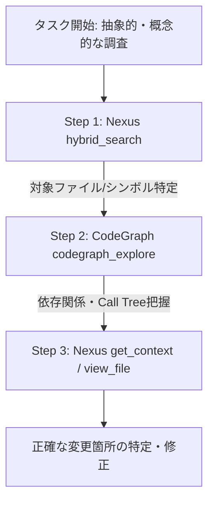

# MCP × Agent Skills 役割分離・再設計 要件定義書（ブラッシュアップ版）

## 1. 目的と背景

* **背景:** 現在 `AGENTS.md` に蓄積されている命令文の肥大化が、コンテキスト（トークン消費）の圧迫やツール呼び出しの迷い・精度の低下を引き起こしている。
* **目的:** システムの「接続・実行基盤（MCP）」と「タスク手順・動的コンテキスト（Skills）」を分離し、**CodeGraphが持つ「明確なトリガー判定」「1ステップ完結（One-Call）情報構造」「遅延読み込み（Deferred Loading）」等の優れた設計**を取り入れることで、トークンコスト削減とコード探索・変更の精度向上を両立させる。

---

## 2. システム構成・アーキテクチャ定義

```
[ AI Agent (Antigravity / Claude Code / Cursor) ]
        │
        ├─ 1. グローバル層 (`AGENTS.md`) ───────── 【常駐】軽量トリガー＆必須制約（50行以内）
        ├─ 2. 知識・手順層 (`.agents/skills/`) ─── 【動的】タスク別最適パイプライン（Nexus × CodeGraph連携）
        └─ 3. 実行・接続層 (`MCP Server`) ───────── 【実行】決定的なワンショット応答＆効率化API
```

| レイヤー | コンポーネント | 役割と管理範囲 | CodeGraphに倣う設計ポイント |
| --- | --- | --- | --- |
| **グローバル層** | `AGENTS.md` | プロジェクト基本制約、スキルおよびツールの**自動検知・呼び出しトリガー定義** | `.codegraph/` のように「特定条件で何を真っ先に使うか」を数行で決定論的に記述 |
| **知識・手順層** | `Skills` (`.agents/skills/`) | タスクごとの実行フロー標準化（NexusとCodeGraphの相乗効果パイプライン定義） | 「セマンティック探索 ➔ AST追跡 ➔ コンテキスト取得」のワンストップ手順 |
| **実行・接続層** | `MCP Server` | コード検索・ベクトルアクセス・システム操作 | **One-Call Completeness**（1回で必要な文脈を返す）と**Deferred Loading**（不要な全文展開を避ける） |

---

## 3. 機能要件詳細

### 3.1 `AGENTS.md`（グローバル層）軽量化＆トリガー定義要件

1. **行数・トークン制限:** 全体を50行以内（約1,000トークン以下）に維持。
2. **決定論的トリガー（CodeGraph方式）の組み込み:**
   * セトリング（事前判定）ルールを1〜2行で定義：
     > 「コード調査・設計把握時は `.agents/skills/code-search.md` をロードせよ。リポジトリ構造の追跡は `.codegraph/` があれば `codegraph_explore`、曖昧な検索は Nexus (`hybrid_search`) を第一選択とせよ。」

---

### 3.2 `Skills`（手順・知識層）再設計要件

#### ① パイプライン定義 (`code-search.md`)
NexusとCodeGraphを競合させず、**相互補完リレー**させる標準フローをStep-by-stepで定義する。



#### ② CodeGraph型「One-Call Completeness」手順の導入
Skill内で「検索（`hybrid_search`）したら、検索結果のトップ候補に対して即座に `get_context` を呼び出して文脈をまとめる」という**AIのマルチステップ行動パターンをテンプレート化**する。

#### ③ 配置構造
```text
.agents/
└── skills/
    ├── code-search.md      # Nexus × CodeGraph ハイブリッドコード探索手順
    ├── refactoring.md      # 影響範囲チェック（CodeGraph）と修正手順
    ├── issue-analysis.md   # エラーログ解析と文脈（Nexus）特定手順
    └── documentation.md    # ドキュメント更新・仕様書生成ルール
```

---

### 3.3 MCP サーバー (`Nexus`) 最適化要件

CodeGraphの持つ「AIエージェントにとって扱いやすいツール設計」をNexus MCP側にも取り入れる。

1. **One-Call 応答機能の強化 (レスポンス補完):**
   * `hybrid_search` にオプション引数（例: `includeSnippet: true` や `contextLines: 5`）を追加するか、ラッパーツールを用意し、**1回の呼び出しで検索結果＋前後コードまで取得可能**にする。
2. **Deferred Loading（遅延読み込み）レスポンス設計:**
   * 長大なファイルや検索結果を返す際、全文を出さずに「概要＋行番号＋詳細取得用コマンド案内」を返し、トークン溢れを防ぐ。
3. **Schema説明文の最適化:**
   * JSON Schema 内の `description` をAIが最も誤解なく判断できる簡潔・直感的な表現に書き換え、初期接続トークンを削減。
4. **検索インデックスからのメタデータ除外:**
   * インデックス対象から `.agents/`, `.nexus/`, `AGENTS.md` を除外設定し、検索ノイズ（自己参照問題）を排除する。

---

## 4. CodeGraph設計要素の取り込みマトリクス

| CodeGraphの優良設計要素 | Nexus / Agents への適用方法 | 期待効果 |
| --- | --- | --- |
| **明確な存在検知 (`.codegraph/`)** | `AGENTS.md` に簡潔な条件分岐ルール（トリガー）を記載 | AIがツール選択に迷わなくなる |
| **1ステップでの情報完結 (One-Call)** | Skill手順で `hybrid_search` ＋ `get_context` の連続実行を標準化、MCPにコンテキスト一括オプション検討 | 思考ステップ数・ツール呼び出し往復の削減 |
| **動的ディスパッチ・呼出ツリー追跡** | 役割分担として「構造追跡はCodeGraph、意味検索はNexus」とSkillで明確に指定 | 両ツールの強みを100%発揮 |
| **遅延読み込み (Deferred Loading)** | 大規模検索結果返却時にサマリー＋参照キーのみを返し、必要部分だけ深掘りさせる仕様 | トークン消費の大幅な節約 |

---

## 5. 移行フェーズ（Phase 1 〜 4）

1. **Phase 1: `AGENTS.md` の軽量化＆トリガー追記**
   * 現行の指示文を整理し、50行以内に収めつつCodeGraph/Nexus/Skillsのルーティング条件を記述。
2. **Phase 2: `.agents/skills/code-search.md` の作成**
   * Nexus ✕ CodeGraph の連携パイプラインとOne-Call型探索手順を記述。
3. **Phase 3: Nexus MCP 側のチューニング**
   * インデックス除外設定 (`.agents/` 等) と JSON Schema 記述の簡素化。
4. **Phase 4: 検証とイテレーション**
   * 複合的なコード探索タスクを実施し、トークン消費量・ツール呼び出し精度・Nexus活用率を計測。
